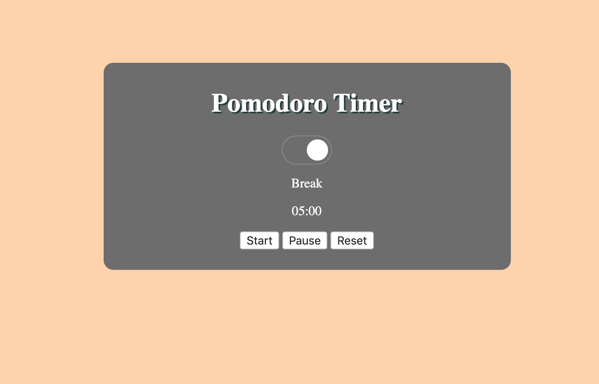
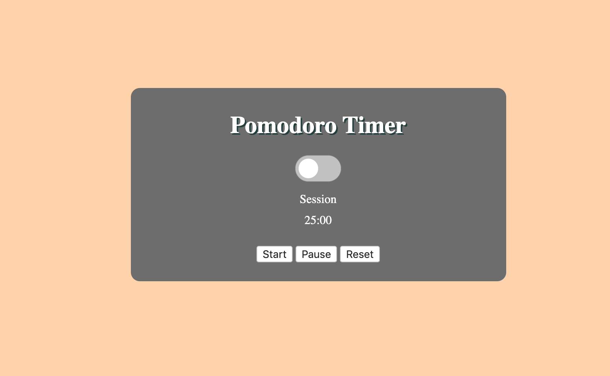

# Pomodoro Timer

 

For my Pomodoro application I used HTML, CSS and JavaScript. 
 

#### View my PomodoroTimer [Click Here](https://graceec.github.io/PomodoroTimer/)

 

 
 

### Technique
Creating this application has helped me improve my JavaScript skills in programming. 

